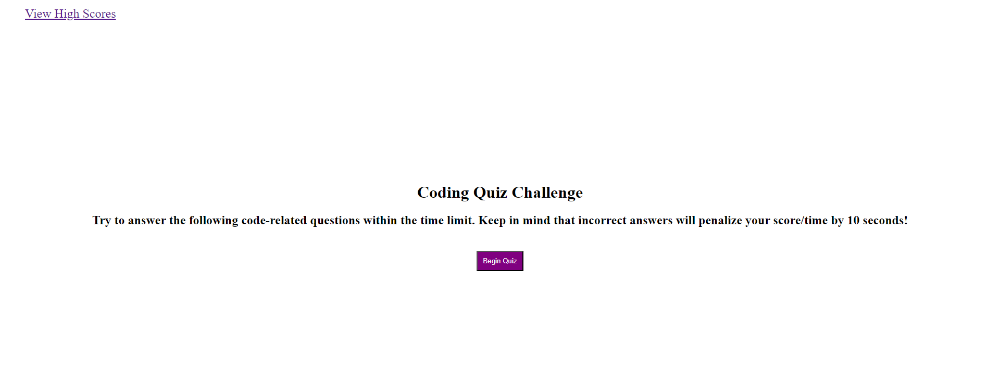

# Code Quiz

## Description

A timed quiz on coding that I made using HTML, CSS, and Javacript

## Installation

N/A

## Usage

Click this link https://m-beke.github.io/code-quiz/ to be taken to the application.

From there, click the begin button to start the quiz. You will be prompted with one question at a time. Correct answers will add points to your score, while incorrect answers will deduct time from the timer. At the end of the quiz, you will have the option to enter your initials to save your high score. From there, you will be taken to a list of high scores from other users. If you would like to clear the high scores, click the "Clear High Scores" button.

## Credits

MDN Web Docs, Stack Overflow

## License

Please refer to the LICENSE in the repo.